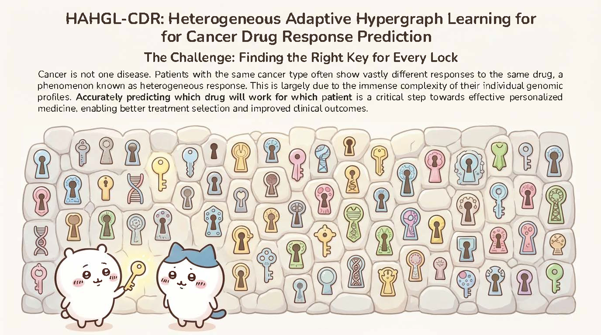
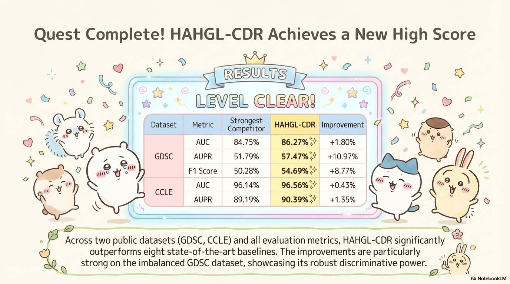

# HAHGL-CDR

## Overview

HAHGL-CDR: Heterogeneous adaptive hypergraph learning for cancer drug response prediction



## Requirements

The provided environment configuration is designed to be compatible with [GraphCDR](https://github.com/BioMedicalBigDataMiningLab/GraphCDR), [RedCDR](https://github.com/mhxu1998/RedCDR), and [DeepCDR](https://github.com/kimmo1019/DeepCDR?tab=readme-ov-file).

### Win-64 or Linux with CUDA11.2

- **python** 3.8.20

```
conda create -n HAHGL-CDR python=3.8.20
```

- **torch** 1.10.1+cu111 [A reference for Pytorch version](https://pytorch.org/get-started/previous-versions/)

```
pip install torch 1.10.1+cu111 torchvision 0.11.2 torchaudio 0.10.1+cu111 -f https://download.pytorch.org/whl/cu111/torch_stable.html
```

- **torch-cluster** 1.5.9
- **torch-sparse** 0.6.13
- **torch-scatter** 2.0.9
- **torch-geometric** 2.0.4

```
pip install torch-sparse 0.6.13 -f https://data.pyg.org/whl/torch-1.10.0+cu111.html
pip install torch-scatter 2.0.9 -f https://data.pyg.org/whl/torch-1.10.0+cu111.html
pip install torch-cluster 1.5.9 -f https://data.pyg.org/whl/torch-1.10.0+cu111.html
pip install torch-geometric 2.0.4
```

- **rikit-pypi** 2022.9.5 (this dependency can only be installed via `pip`).

```
pip install rdkit-pypi 2022.9.5
```

- **deepchem** 2.5.0
- **pubchempy** 1.0.4

```
pip install deepchem 2.5.0 pubchempy 1.0.4
```

- **h5py** 2.10.0
- **hickle** 5.0.3

```
pip install h5py 2.10.0 hickle 5.0.3
```

- **tensorflow** 2.3.0

```
pip install tensorflow 2.3.0 numpy 1.18.5
```

- **seaborn** 0.13.2
- **scikit-learn** 0.24.2

```
pip install seaborn 0.13.2 scikit-learn 0.24.2
```

- **scipy** 1.4.1
- **matplotlib** 3.7.5

```
pip install scipy 1.4.1 matplotlib 3.7.5
```

- **numpy** 1.18.5
- **pandas** 1.1.5
- **dill** 0.4.0

```
pip install dill 0.4.0 numpy 1.18.5 pandas 1.1.5
```

### MacOS or CPU only

* **Python** 3.8.20 – Python version
* **numpy** 1.24.3 – Scientific computing
* **pandas** 2.0.3 – Data processing
* **scipy** 1.10.1 – Scientific computing
* **scikit-learn** 1.3.2 – Machine learning
* **matplotlib** 3.7.5 – Visualization
* **seaborn** 0.13.2 – Visualization
* **tqdm** 4.67.1 – Progress bars
* **torch** 1.10.1 – PyTorch deep learning framework
* **torch-geometric** 2.0.4 – Graph Neural Networks (GNN)
* **torch-scatter** 2.0.9 – GNN operations
* **torch-sparse** 0.6.13 – GNN operations
* **torch-cluster** 1.5.9 – GNN operations
* **deepchem** 2.5.0 – Cheminformatics and drug modeling
* **rdkit-pypi** 2022.9.5 – Molecular descriptors
* **tensorflow** 2.13.0 – Deep learning (optional)
* **keras** 2.13.1 – High-level neural network API (optional)
* **h5py** 3.11.0 – HDF5 file handling
* **dill** 0.4.0 – Object serialization

## Data preparation

### GDSC and CCLE

**Please unzip the data file `data.zip`.** We evaluate HAHGL-CDR on two datasets, GDSC and CCLE, which are retrieved from [RedCDR](https://github.com/mhxu1998/RedCDR). The `data` directory structure and file formats are detailed as follows:

```
data/
│
├── Celline/                          # Cell Line Data Directory
│   ├── Cell_lines_annotations.txt    # Cell line metadata and cancer type annotations
│   ├── GDSC_IC50.csv                 # Drug response data (IC50 values)
│   │
│   ├── genomic_mutation_34673_demap_features.csv      # [MUTATION OMICS]
│   │   └── Mutation features: 34,673 genomic mutation features
│   │   └── Cell lines: 561 cell lines
│   │   └── Format: CSV with cell line IDs as index, mutation features as columns
│   │
│   ├── genomic_expression_561celllines_697genes_demap_features.csv  # [EXPRESSION OMICS]
│   │   └── Gene expression features: 697 genes
│   │   └── Cell lines: 561 cell lines
│   │   └── Format: CSV with cell line IDs as index, gene expression values as columns
│   │
│   └── genomic_methylation_561celllines_808genes_demap_features.csv  # [METHYLATION OMICS]
│       └── DNA methylation features: 808 methylation sites
│       └── Cell lines: 561 cell lines
│       └── Format: CSV with cell line IDs as index, methylation values as columns
│
├── Drug/                             # Drug Data Directory
│   ├── 1.Drug_listMon Jun 24 09_00_55 2019.csv  # [DRUG METADATA]
│   │   └── Drug information: ID, Name, Synonyms, Targets, PubCHEM ID
│   │   └── Columns: drug_id, Name, Synonyms, Targets, Target pathway, PubCHEM, Sample Size, Count
│   │
│   ├── drug_threshold.txt            # [DRUG THRESHOLD]
│   │   └── IC50 thresholds for binary classification (sensitive/resistant)
│   │   └── Format: Tab-separated, PubCHEM ID and threshold value
│   │
│   ├── drug_threshold.csv            # Alternative format of drug thresholds
│   │
│   ├── 222drugs_pubchem_smiles.txt   # [DRUG SMILES]
│   │   └── SMILES strings for 222 drugs
│   │   └── Format: PubCHEM ID and corresponding SMILES notation
│   │
│   ├── drug_graph_feat.zip           # [DRUG GRAPH FEATURES]
│   │   └── Pre-computed molecular graph features
│   │   └── Contains: atom features, adjacency lists, degree lists, bond matrices
│   │
│   ├── new/                          # Drug graph features directory (alternative format)
│   │
│   ├── new_edge/                     # [DRUG GRAPH FEATURES WITH EDGE INFO]
│   │   └── Drug molecular graph features with bond/edge information
│   │   └── Format: Pickle files (.pkl) per drug (PubCHEM ID as filename)
│   │   └── Each file contains: (feat_mat, adj_list, degree_list, bond_matrix)
│   │
│   └── SMILES2pkl.py                 # Utility script for converting SMILES to graph
│
└── CCLE/                             # CCLE Dataset Directory
    ├── CCLE_response.csv             # [CCLE RESPONSE DATA]
    │   └── Drug response data for CCLE cell lines
    │   └── Columns: DepMap_ID, pubchem, Z_SCORE
    │
    └── CCLE_smiles.csv               # [CCLE DRUG SMILES]
        └── SMILES strings for drugs in CCLE dataset
        └── Columns: pubchem, isosmiles
```

### External validation on TCGA

We also provide the optional TCGA dataset, which includes external clinical patient data downloaded from [Firehose Broad GDAC](http://gdac.broadinstitute.org/runs/stddata__2016_01_28/). In the `data/TCGA/` directory, we provide preprocessed patient multi-omics features (mut, gen, and met) along with drug response records. The preprocessing methods follow previous studies [Sharifi-Noghabi et al.](https://doi.org/10.1093/bioinformatics/btz318) and [Ding et al.](https://doi.org/10.1093/bioinformatics/btw344).

## Usage of HAHGL-CDR

* **Step 1**: unzip datasets in `data.zip`

* **Step 2**: load the pre-trained model from the `save/` directory (GDSC default)

  ```bash
  python load_model.py
  ```

* **Step 3 (Alternative)**: train the model on GDSC / CCLE / TCGA:

  ```bash
  python main_GDSC.py
  ```



## Acknowledgments

This work has received generous support and valuable contributions from funders and allies, **with special thanks to my advisor and my collaborators**, as well as all contributors who supported the development of HAHGL-CDR:


